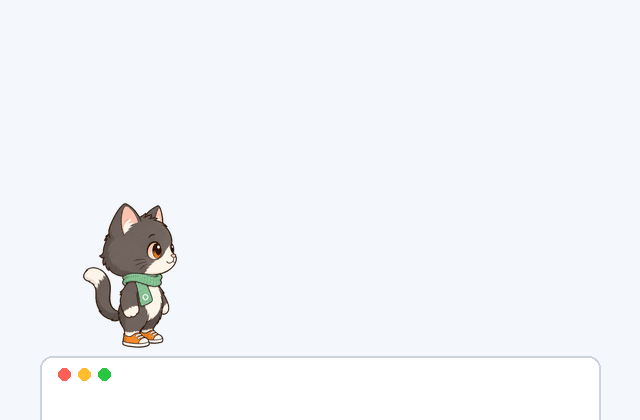

# omo-pet

[English](README.md) · **简体中文** · [日本語](README.ja.md) · [한국어](README.ko.md)

**小猫 Omo 住在你的显示器上。** 这是一只开源桌面宠物，把你的应用窗口当成平台：
Omo 会在窗口上散步，坐火箭飞到别的显示器，再撑着降落伞慢慢飘下来，甚至还能跳到你的 iPad 上。

基于 [Tauri 2](https://tauri.app)（透明、无边框、始终置顶的窗口）和原生 TypeScript 开发。
omo-pet 是 [hermes-pet](https://github.com/Heoooooon/hermes-pet) 的分支，换上了新的默认角色，
并支持本地角色包。

## 预览

<p align="center">
  
</p>
<p align="center"><sub>🚶 走路 → 🚀 火箭 → ✈️ 喷气机 → 🪂 降落伞 → 爬上去坐好（Omo 角色包精灵图）</sub></p>

每个动作都是一张 APNG 精灵图（在这里就能直接播放）：

| idle | walk | rocket | jet | parachute | climb & sit |
| :-: | :-: | :-: | :-: | :-: | :-: |
|  |  |  |  |  |  |

## 功能

- 🚶 **在窗口上散步**：把真实应用窗口的上边缘当作平台，爬上去沿着走；窗口移动时也会跟着一起走
- 🪂 **降落伞**：脚下的平台消失，或者从高处落下时，会撑开降落伞慢慢飘下来
- 🚀 **火箭和喷气背包**：垂直发射的火箭，以及横向冲刺的喷气飞行
- 🖥️ **多显示器**：可以在缩放比例不同的显示器之间穿梭（Retina + 外接屏），左右并排或上下堆叠都支持
- 📱 **iPad 接力**：如果正在运行 Lanbeam 代理（独立项目），Omo 会在屏幕边缘跳到你的 iPad 上（可选功能，没有它也能完整运行）
- 🎛️ **设置界面**：右键 → 设置，可以切换角色，实时调整大小、速度、活跃度和特技频率
- 🎭 **角色包**：把各个动作的 APNG 放进 `public/packs/<name>/`，就能做出新角色
- 🐾 **召唤小伙伴**：最多可以添加 3 个小伙伴，每个的性格（体型、步态）都略有不同
- 🔍 **识别叠加层**：每个显示器上都有一层叠加显示，标出哪些窗口被当作平台
- ✋ **拖拽 / 💖 点击反应**：把 Omo 拎起来，它会晃来晃去；点它一下，它会送你一颗爱心

## 快速开始

环境要求：[Node.js](https://nodejs.org) 18+ 以及 [Rust](https://rustup.rs) 工具链。

```bash
npm install
npm run tauri dev     # run in development mode
npm run tauri build   # build a release app
```

- 操作方式：拖动来移动 · 点击触发反应 · **右键**打开菜单（Friend+ / 设置 / 识别叠加层 / 退出）
- 界面语言：在 **Settings（设置）→ Language（语言）** 中切换英语或韩语，选择会保存；默认使用英语，系统语言为韩语时使用韩语。
- 窗口检测只用公开 API，不需要任何额外权限
  （macOS `CGWindowListCopyWindowInfo` / Windows `EnumWindows` + DWM）。
- 主要支持 macOS。Windows 版本还处于实验阶段（窗口检测代码能编译，但还没在真机上测试过）。
  Windows 的构建步骤请看 [hermes-pet README](https://github.com/Heoooooon/hermes-pet#getting-started)，
  这里的步骤完全一样。

## 粉丝自制的吉伊卡哇角色包（在你自己的电脑上生成）

你可以把 LINE 官方动态贴图里吉伊卡哇角色们的预览图做成本地角色包。
加上 `--generate`，还会为每个角色画出 Omo 的全部动作（走路、火箭、喷射、降落伞、爬上边缘、着陆等）：

```bash
node scripts/make-chiikawa-pack.mjs                                # sticker-only packs (quick)
node scripts/make-chiikawa-pack.mjs --generate                     # every action, all 7 characters
node scripts/make-chiikawa-pack.mjs --chars usagi,momonga --generate
node scripts/make-chiikawa-pack.mjs --chars usagi --generate --regen walk,jet  # redraw some actions
node scripts/make-chiikawa-pack.mjs --remove                       # delete them again
```

| 角色包（`--chars`） | 来自官方贴图 | 用 `--generate` 画 |
|---|---|---|
| `chiikawa`（吉伊卡哇） | idle, react | 其余全部 |
| `hachiware`（小八） | — | 全部动作 |
| `usagi`（乌萨奇） | idle（2 个）, react, drag | 其余全部 |
| `momonga`（飞鼠） | idle, react, drag | 其余全部 |
| `kurimanju`（栗子馒头） | — | 全部动作 |
| `yoroi`（铠甲先生） | react | 其余全部 |
| `yusangyun`（むちゃうマン） | — | 全部动作 |

脚本会把 LINE STORE 上的贴图下载到你的电脑里，擦掉飘在旁边的效果文字，把所有动作缩放到同样的身体大小，
再写入 `public/packs/<character>/` 和 `public/packs/local.json`。之后在设置里选中这个角色就行。
只会用角色单独出现、全身可见的贴图。不加 `--generate` 时，没有贴图的动作会退回使用 idle，
没有全身贴图的角色会被跳过。脚本需要 `ffmpeg`。`--generate` 还需要一份 [sprite-gen](https://github.com/aldegad/sprite-gen) 代码
（`SPRITE_GEN_DIR`，并装好它的 `.venv`）和已登录的 `codex` CLI
（它用的是你的 ChatGPT 订阅，不需要 API key，也不会按次计费）。它会参考该角色的贴图和官方周边照片来画，
每个动作大约一分钟，帧会缓存在 `.cache/chiikawa/gen/` 里供下次使用。

> **粉丝自制、非官方、非商业。** 本项目与吉伊卡哇的版权方没有任何关联，也未获得其认可。
> **本仓库不包含任何吉伊卡哇的图像**：图片由每位用户在自己的电脑上下载，仅供个人使用，
> 而且 `public/packs/*` 已被 git 忽略。请不要提交或再次分发生成的角色包。Chiikawa © nagano / chiikawa committee.

## 使用你自己的角色

一个角色包就是一个装着精灵图的文件夹，路径为 `public/packs/<pack>/<state>.apng`
（idle / walk / drag / react / fall / edge / rocket / jet，另外还有可选的
`fall-open` / `fall-glide` / `fall-land` 阶段）。缺少的动作都会退回到 idle，
变体（`<state>.2.apng` … `<state>.4.apng`）会随机选用。把你的角色包写进
`public/packs/local.json`，它就会出现在设置里：

```json
[{ "id": "my-pack", "name": "My pack", "emoji": "🦊" }]
```

Omo 角色包是用 [sprite-gen](https://github.com/aldegad/sprite-gen) 做的：
一张静态图（`art/omo-cat/base.png`）→ 每个动作跑一次 sprite-gen
（`art/sprites/omo-<state>/`，包含请求、提示词、原始序列和各帧）→ 用 `ffmpeg` 合成 APNG。
完整做法写在 `.claude/skills/add-action/SKILL.md` 里。

## 项目结构

```
src/main.ts              Behavior brain: state machine, window-platform physics,
                         multi-monitor crossing, Lanbeam handoff, pack loading
src/style.css            Per-state CSS motion and per-pack sprite sizes
src/settings.ts          Settings panel (packs from packs.json + local.json)
src-tauri/               Tauri shell: transparent window, window list, Lanbeam bridge client
public/packs/omo-cat/    The bundled Omo pack (APNG per action)
scripts/                 make-chiikawa-pack.mjs (local fan-made packs)
art/                     Omo source still + sprite-gen run records
```

## 致谢

- 基于 **[hermes-pet](https://github.com/Heoooooon/hermes-pet)**（MIT）：
  桌面宠物引擎、窗口平台物理，以及多显示器和 iPad 功能
- **精灵图生成**：[sprite-gen](https://github.com/aldegad/sprite-gen)（@aldegad）
- **Omo** 是 CMORE 的原创角色
- Chiikawa © nagano / chiikawa committee（仅限粉丝自制的本地角色包，不包含在仓库中）

## 许可证

[MIT](./LICENSE)：适用于代码和 Omo 的美术素材（`art/`、
`public/packs/omo-cat/`）。用吉伊卡哇脚本在本地生成的角色归其版权方所有，不在许可范围内。
